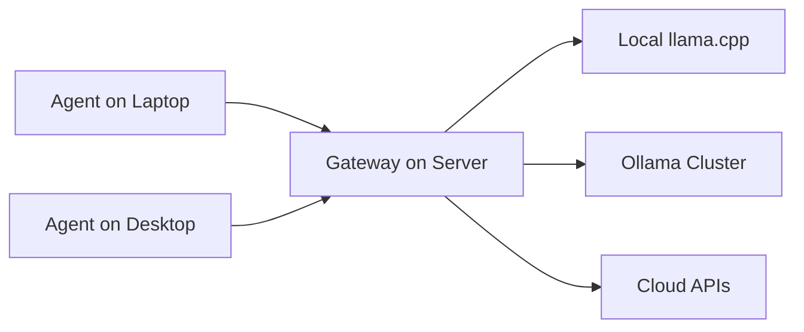

Most AI coding assistants are cloud services with a thin local client. Your code, your prompts, your context — all processed on someone else's server.

Hermes Agent takes a different approach. It's **local-first** by design.

## What Local-First Actually Means

Your data stays on your machine. The agent process, tool execution, and context management all run locally. When you use a cloud model, only the prompt and response travel over the network. Nothing else.

Beyond data residency, local-first means:

- **Offline models** — Hermes supports local LLMs via llama.cpp, Ollama, and custom endpoints. No internet, no problem.
- **No telemetry** — Hermes never phones home. No usage stats, no crash reports.
- **Self-contained** — the entire agent installs from a single directory. No Docker required, no cloud authentication.
- **Config as code** — your provider keys, model preferences, and tool permissions live in a local `config.yaml`, not a cloud dashboard.

## The Local LLM Pipeline

For the privacy-conscious, Hermes's local model support is production-grade:

```yaml
providers:
  local:
    type: llama.cpp
    model_path: /models/hermes-3-70b.Q4_K_M.gguf
    context_length: 32768
    gpu_layers: 35
    n_batch: 512
    temperature: 0.2
```

This is a fully functional pipeline handling tool calling, structured output, and multi-turn conversations through a local GGUF model. The pipeline supports:

| Feature | Implementation |
|---------|----------------|
| Tool calling | JSON schema validation + function dispatch via `llama.cpp` grammar |
| Structured output | Guided JSON generation with `gbnf` grammars |
| Streaming | Token-by-token via server-sent events from local server |
| Context window | Up to 128k tokens (model-dependent) |
| Quantization | Q4_K_M, Q5_K_M, Q8_0 — trade speed for quality |

### Ollama Integration

Hermes also speaks Ollama natively for teams already running local model servers:

```yaml
providers:
  local-ollama:
    type: ollama
    base_url: http://localhost:11434
    model: hermes3:70b-q4_k_m
    keep_alive: "10m"
```

This lets you share a single model server across multiple Hermes agents — useful for team laptops hitting a shared GPU box.

## Gateway Architecture for Hybrid Deployments

Local-first doesn't mean cloud-hostile. Hermes's **gateway architecture** lets you run a shared gateway on a server while individual agents connect from any machine. Agents are stateless and disposable. The gateway provides durable infrastructure for shared provider configuration and secret management.



### Gateway Responsibilities

1. **Provider registry** — single source of truth for model endpoints, API keys, and capabilities
2. **Secret management** — encrypted vault for API keys, rotated without agent restarts
3. **Request routing** — intelligent routing (local first, cloud fallback, cost-aware)
4. **Audit logging** — who asked what, when, with which model (local only, never uploaded)

### Deployment Patterns

| Pattern | Use Case | Trade-off |
|---------|----------|-----------|
| Pure local | Air-gapped, maximum privacy | No shared config, each agent manages own models |
| Gateway + local agents | Team sharing GPU server | Single point of failure for gateway |
| Hybrid (gateway + cloud fallback) | Cost-sensitive teams | Cloud calls leave network (logged) |

## Why Local-First Wins for Teams

Beyond privacy, local-first gives teams control:

- **No vendor lock-in** — switch providers by changing config, not rewriting code
- **No API dependency** — local models work when providers are down or rate-limited
- **No data exposure** — sensitive code never leaves your network
- **Cost control** — cheap local models for routine tasks, expensive cloud models only for complex reasoning
- **Auditability** — every prompt, tool call, and response logged locally

### Real-World Team Workflow

A 10-person team running Hermes with a shared gateway:

1. **Infra team** provisions a GPU server with `llama.cpp` server + Ollama for model variety
2. **Gateway** runs on the same box, exposes `/v1/chat/completions` compatible endpoint
3. **Developers** install Hermes Desktop, point `gateway_url` to team server
4. **Secrets** stored in gateway vault — developers never see API keys
5. **Routing rules** send 80% of traffic to local models, 20% to cloud for complex reasoning

Result: ~$200/mo GPU server replaces ~$2,000/mo in API costs for equivalent throughput.

## Comparison: Hermes vs Cloud-First Agents

| Dimension | Cloud-First (Cursor, Copilot, Claude Code) | Hermes (Local-First) |
|-----------|--------------------------------------------|----------------------|
| Code leaves machine | Yes (full context) | Only prompts to cloud models |
| Offline capability | None | Full (with local models) |
| Telemetry | Opt-out at best | None |
| Model choice | Vendor-locked | Any GGUF/Ollama/OpenAI-compatible |
| Team secrets | Cloud vault | Local gateway vault |
| Cost at scale | $20-100/user/mo | Hardware + electricity |

## Security Model Deep Dive

Hermes's threat model assumes the **network is hostile**:

1. **Local process isolation** — each tool runs in its own sandboxed subprocess
2. **Credential guards** — API keys never enter agent context; gateway injects headers at request time
3. **Provider isolation** — cloud providers see only the prompt, not your filesystem or other provider keys
4. **Audit trail** — local SQLite log of every agent action, queryable but never transmitted

This is documented in our [security credential guards and provider isolation piece](/blog/hermes-security-credential-guards-provider-isolation/).

## Getting Started: Local-First in 5 Minutes

```bash
# 1. Install Hermes
curl -fsSL https://get.hermesagent.dev | bash

# 2. Pull a local model (requires ~40GB RAM for 70B Q4)
ollama pull hermes3:70b-q4_k_m

# 3. Configure local provider
cat > ~/.config/hermes/config.yaml <<'EOF'
providers:
  local:
    type: ollama
    base_url: http://localhost:11434
    model: hermes3:70b-q4_k_m
EOF

# 4. Run
hermes "refactor this React component to use hooks"
```

For GPU-constrained machines, smaller models work well:
- `qwen2.5-coder:7b` (~4GB) — excellent for code tasks
- `hermes3:8b` (~5GB) — strong general reasoning
- `deepseek-coder-v2:16b` (~10GB) — best open code model under 16B

## When to Use Cloud Models

Local-first isn't dogma. Hermes makes cloud models a **conscious choice**, not a default:

- **Complex architectural reasoning** — 70B+ cloud models still edge out local
- **Multimodal tasks** — vision/audio not yet practical locally
- **Rapid prototyping** — zero setup, instant access to frontier models
- **Team without GPU budget** — cloud is cheaper than hardware for small teams

The key: **you decide per-task**, not per-subscription.

---

*You already use AI agents for coding. Why limit yourself to one model? **[aiFiesta](https://aifiesta.link/muhammed-anshad)** ($12/mo) gives you every premium model in one dashboard — Claude, GPT, Gemini, Grok and more.*

## Related articles

- [Hermes Agent v0.19.1 Quicksilver: 80% Faster Starts, Smart Approvals, and Secrets That Survive](/blog/hermes-agent-v019-quicksilver-80-percent-faster/)
- [Hermes Agent Deep Dive: The Most Capable Open-Source Autonomous Coding Assistant](/blog/deep-dive-hermes-agent-autonomous-coding-assistant/)
- [Confessor: A Local Tool That Replays What Your AI Coding Agent Actually Read](/blog/confessor-audit-what-ai-coding-agent-touched/)
- [Hermes Security: Credential Guards and Provider Isolation](/blog/hermes-security-credential-guards-provider-isolation/)
- [Coding Agent Security Checklist 2026](/blog/coding-agent-security-checklist-2026/)
- [Confessor: A Local Tool That Replays What Your AI Coding Agent Actually Read](/blog/confessor-audit-what-ai-coding-agent-touched/)